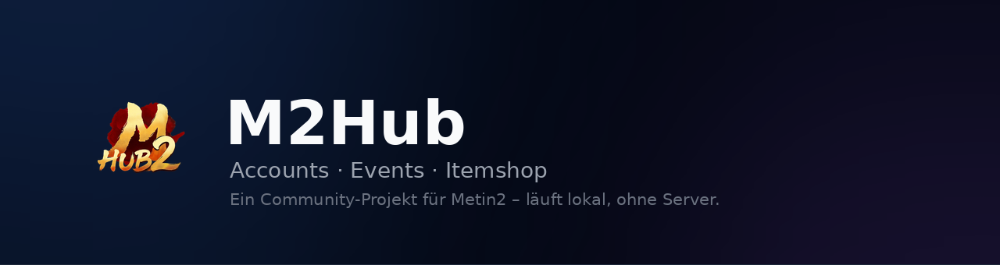

 

### [⬇️ &nbsp; M2Hub herunterladen](https://github.com/EinfachFabsTV/Metin2Hub/releases/latest)

**Kostenlos · ohne Installation · ohne Konto · ohne Werbung**

---

M2Hub ist ein Programm für den eigenen Rechner. Es sammelt, was man sonst über
Forenreiter, Notizzettel und Excel-Tabellen verteilt: welche Events gerade
laufen, was im Itemshop ansteht, und wie es um die eigenen Accounts und
Charaktere steht.

## Was M2Hub kann

<table>
<tr>
<td width="33%" valign="top">

### 👤 &nbsp;Accounts

Alle Accounts auf einen Blick, mit Charakteren, Leveln und gespendeten
Medaillen.

Wer die **Orkzahn-Bio** schon erledigt hat, ist ebenso zu sehen wie die
**Meley-Charaktere** und die, die noch **leveln**. Medaillen trägt man mit einem
Klick nach, auch für viele Charaktere auf einmal.

Wer Clients in mehreren **Sprachen** nutzt, ordnet jedem Account seine Sprache
zu und erkennt sie an der Farbe.

</td>
<td width="33%" valign="top">

### 📅 &nbsp;Events

Der **Eventkalender je Server** – Ruby/Sapphire und Tigerghost jeweils als
eigener Reiter, mit Symbol zu jedem Eintrag.

Dazu die **weltweiten Ankündigungen** mit Bild, Zeitraum und Text.

Was gerade läuft, steht **oben im Fenster** – auch dann, wenn man gerade bei
den Accounts ist.

</td>
<td width="33%" valign="top">

### 🛒 &nbsp;Itemshop

Die **laufenden und kommenden Aktionen**, nach Zeitpunkt sortiert.

**Happy Hours** erscheinen oben im Fenster, solange sie laufen.

Abgelaufenes lässt sich mit einem Haken einblenden, wenn man nachsehen möchte,
was zuletzt war.

</td>
</tr>
</table>

## Erste Schritte

1. Auf der [Download-Seite](https://github.com/EinfachFabsTV/Metin2Hub/releases/latest)
   die Datei `M2Hub.exe` herunterladen.
2. Doppelklick – fertig. Es gibt keine Installation und keine Einrichtung.
3. Beim ersten Start zeigt Windows eine blaue Warnung. Das ist normal und unten
   Schritt für Schritt erklärt: [Die blaue Windows-Warnung beim ersten
   Start](#die-blaue-windows-warnung-beim-ersten-start).

Vorausgesetzt wird Windows 10 oder neuer. Weitere Software ist nicht nötig –
das Programm bringt alles mit, was es braucht.

## Die blaue Windows-Warnung beim ersten Start

Beim ersten Öffnen erscheint ein blaues Fenster:

> **Der Computer wurde durch Windows geschützt**
> Von Microsoft Defender SmartScreen wurde der Start einer unbekannten App
> verhindert.

Zunächst gibt es dort nur den Knopf **„Nicht ausführen"**. Der Weg zum Start
führt über den Link:

| Schritt | Was zu tun ist |
|:--:|---|
| 1 | Auf **„Weitere Informationen"** klicken – den Link unter dem Text |
| 2 | Das Fenster klappt auf und zeigt `App: M2Hub.exe` und `Herausgeber: Unbekannter Herausgeber` |
| 3 | Auf **„Trotzdem ausführen"** klicken |

Das war es – die Warnung erscheint nur beim ersten Mal. Danach startet M2Hub
mit einem Doppelklick.

> [!TIP]
> **Falls „Weitere Informationen" fehlt** oder der Download schon vorher
> blockiert wurde: Rechtsklick auf `M2Hub.exe` → **Eigenschaften** → unten bei
> „Sicherheit" den Haken bei **„Zulassen"** setzen → **OK**.

### Warum kommt diese Warnung?

Sie sagt nichts über den Inhalt der Datei aus. Windows kennt das Programm
schlicht noch nicht: SmartScreen warnt bei jeder Anwendung, die weder eine
gekaufte Signatur trägt noch bereits von vielen Menschen heruntergeladen wurde.
Eine solche Signatur kostet jährlich mehrere hundert Euro – für ein kostenloses
Projekt aus der Community ist das nicht angemessen.

Es ist also **keine Virenmeldung**, sondern ein Hinweis auf einen unbekannten
Herausgeber. Mit steigender Zahl an Downloads verschwindet sie mit der Zeit von
selbst.

### Sicher bleiben

- **Lade M2Hub nur von der
  [offiziellen Download-Seite](https://github.com/EinfachFabsTV/Metin2Hub/releases/latest).**
  Dateien aus Foren, von Filehostern oder aus Discord-Anhängen können verändert
  sein – dort ist die Warnung dann berechtigt.
- Die Datei heißt immer `M2Hub.exe` und ist rund 92 MB groß. Deutlich kleinere
  Dateien oder Varianten mit Zusätzen im Namen stammen nicht von hier.
- Wer ganz sicher gehen will, vergleicht die Prüfsumme: Auf der Release-Seite
  steht neben der Datei ein `sha256:…`-Wert. In PowerShell liefert
  `Get-FileHash .\M2Hub.exe` denselben Wert, wenn die Datei unverändert ist.

Sollte dein Virenscanner anschlagen, ist das ebenfalls dem unbekannten
Herausgeber geschuldet – es ist ein Fehlalarm. Wenn du unsicher bist, lade die
Datei bei [VirusTotal](https://www.virustotal.com) hoch und sieh dir das
Ergebnis an, bevor du sie startest.

## 🔒 &nbsp;Deine Daten bleiben auf deinem Rechner

Das ist keine Beteuerung, sondern eine Bauentscheidung: **M2Hub hat keinen
Server.** Es gibt keine Stelle, an die Daten fließen könnten.

|  | |
|:--:|---|
| 🚫 | **Kein Konto, keine Anmeldung, kein Passwort.** Es gibt nichts anzulegen und nichts zu verlieren. |
| 💾 | **Accounts, Charaktere und Medaillen liegen ausschließlich bei dir**, in einer Datei in deinem Windows-Benutzerordner. Sie werden nirgendwohin übertragen – auch nicht zu uns. |
| 👁️ | **Keine Sammlung von Nutzungsdaten**, keine Werbung, keine Zählpixel. |
| 🔑 | **Nach Zugangsdaten wird nie gefragt.** M2Hub braucht dein Spiel-Passwort nicht und würde es nicht speichern. Sollte dich jemals ein Programm danach fragen, das sich als M2Hub ausgibt, ist es nicht M2Hub. |

Ins Netz greift das Programm nur an einer Stelle: Es liest den öffentlichen
Eventkalender und die Ankündigungen im offiziellen Metin2-Forum – dieselben
Seiten, die man auch im Browser aufrufen würde. Diese Angaben werden auf dem
eigenen Rechner zwischengespeichert und nach sieben Tagen verworfen. Dabei
werden keinerlei persönliche Daten übermittelt.

Wer seine Einträge sichern oder auf einen anderen Rechner mitnehmen möchte,
kopiert die Datei `accounts.json` – zu finden über **Einstellungen → Ordner
öffnen**.

## Aktualisierungen

Beim Start sieht M2Hub nach, ob eine neuere Version vorliegt. Auf Knopfdruck
lädt die App sie herunter, ersetzt sich selbst und startet neu – ein erneutes
Herunterladen von Hand ist nicht nötig.

Wer das nicht möchte, schaltet die Prüfung in den Einstellungen ab.

## Rückmeldungen

Fehler, Wünsche und Anmerkungen gehören in die
[Issues](https://github.com/EinfachFabsTV/Metin2Hub/issues). Besonders hilfreich
sind Bildschirmfotos und die Angabe, welche Version du nutzt – sie steht unter
Einstellungen.

## ⚠️ &nbsp;Hinweis

> **M2Hub ist ein Projekt aus der Community und steht in keiner Verbindung zu
> Gameforge oder zu Metin2.** Es ist kein offizielles Angebot, wird von
> Gameforge weder betrieben noch unterstützt oder geprüft, und spricht nicht für
> das Unternehmen.

Das Programm liest ausschließlich öffentlich einsehbare Forenbeiträge und zeigt
sie übersichtlicher an. Es greift nicht in das Spiel ein, verändert nichts am
Client und automatisiert keine Spielhandlungen.

Alle Marken- und Produktnamen gehören ihren jeweiligen Inhabern. „Metin2" ist
eine Marke der Gameforge 4D GmbH.

Für Angaben aus dem Forum wird keine Gewähr übernommen – im Zweifel gilt immer
die offizielle Ankündigung.

## Lizenz

[GNU General Public License v3.0](LICENSE)

 
Gemacht für die deutschsprachige Metin2-Community.

